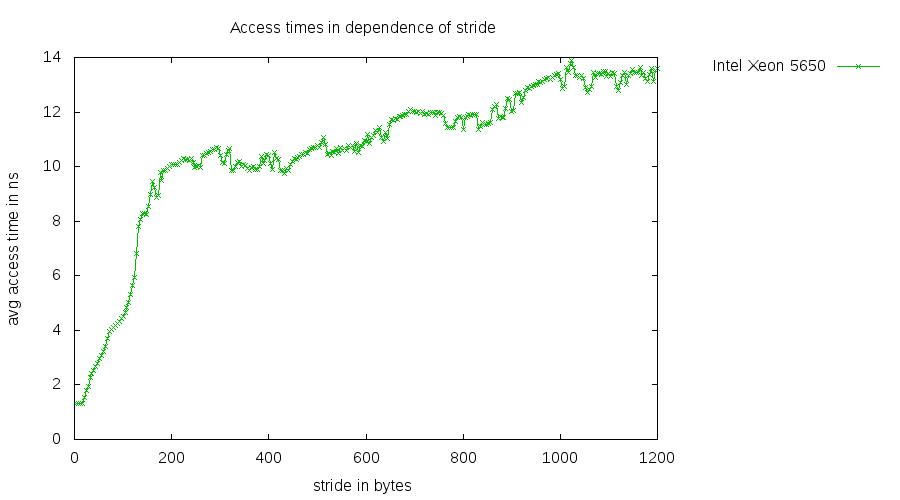
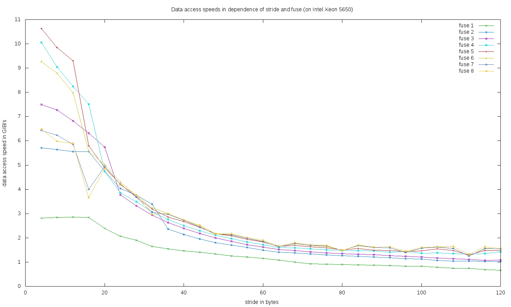

# pointer-chasing
Utilities to measure read access times of caches, memory, and hardware prefetches for simple and fused operations

## Summary

This package provides the following three utilities:

* _random-chase_: measure average read access times of all cache
  levels and main memory
* _linear-chase_: measure read access times for a linear access
  pattern with a constant stride
* _fused-linear-chase_: like _linear-chase_ but for an interleaved
  access pattern of multiple linear sequences, all with the same stride

All of them work with memory buffers that are organized as an array
of pointers where
* all pointers point into the very same buffer, and where
* beginning from any pointer all other pointers can be reached
  following the pointer chain, and where
* all locations are reached.

Once such a memory buffer has been set up, we measure the time of

```C
void** p = (void**) memory[0];
while (count-- > 0) {
   p = (void**) *p;
}
```

The `p = (void**) *p` construct enforces all memory accesses to be
serialized, i.e. the next access can only be scheduled by the processor
when the previous fetch has been finished. To defeat optimizers who
tend to optimize the loop away when the result isn't used, the last
pointer value is assigned to a `volatile` global variable which is
otherwise unused.

In case of _fused-linear-chase_ multiple such buffers are configured
in dependence of the fuse factor.

For the sake of simplicity, all utilities are parameterized through
preprocessor macros.

The idea of pointer chasing is not new, in fact there exist quite
a number of papers and other utilities related to it.

## random-chase

Following preprocessor macros allow to configure this utility:

* *MIN_SIZE*: Minimal buffer size in bytes which should be small enough
  to fit comfortably into the L1 cache.
* *MAX_SIZE*: Maximal buffer size in bytes which should be larger than
  the L3 cache.
* *GRANULARITY*: All powers of two between *MIN_SIZE* and *MAX_SIZE*
  are tested. The granularity specifies how many sizes are tested
  in-between. For a granularity of _n_ > 0 we get _2^{n-1}_ sizes in-between.

The output consists of a header line and then a line for each tested
buffer size from *MIN_SIZE* to *MAX_SIZE* where the memory size and
the measured access time in nanoseconds is given.

This is the sample output for an Intel Xeon 5650 with three caches
(L1: 32 KiB, L2: 256 KiB, L3: 12 MiB) with default
parameters, i.e. *MIN_SIZE* = 1024, *MAX_SIZE* = 32 MiB, and
*GRANULARITY* = 1:

```
  memsize  time in ns
     1024     1.36904
     1536     1.35973
     2048     1.36904
     3072     1.35973
     4096     1.35973
     6144     1.36904
     8192     1.35973
    12288     1.35973
    16384     1.35973
    24576     1.37836
    32768     1.36904
    49152     2.06754
    65536     2.43075
    98304     2.79397
   131072     2.97092
   196608     3.14787
   262144     3.29688
   393216     8.37259
   524288    10.85922
   786432    13.20615
  1048576    14.38893
  1572864    15.59965
  2097152    16.23295
  3145728    18.08628
  4194304    18.34705
  6291456    19.79060
  8388608    22.66839
 12582912    31.55321
 16777216    43.27856
 25165824    59.39975
 33554432    64.04705
```

A gnuplot script may be helpful to visualize this:

```gnuplot
set terminal png size 900, 500
set output "random-chase.png"
set xlabel "memory area in bytes"
set logscale x
set ylabel "avg access time in ns"
set title "Access times in dependence of memory area"
set key out
set pointsize 0.5

# determine maximal y value by plotting to a dummy terminal
set terminal push
set terminal unknown
plot "random-chase.out" using 2
set terminal pop

# mark L1, L2, and L3:
maxy = GPVAL_Y_MAX
l1 = 32
l2 = 256
l3 = 12288
set arrow from l1*1024,0 to l1*1024,maxy nohead lc rgb 'blue';
set arrow from l2*1024,0 to l2*1024,maxy nohead lc rgb 'blue';
set arrow from l3*1024,0 to l3*1024,maxy nohead lc rgb 'blue';

plot "random-chase.out" using 1:2 with linespoints lt 2 title "Intel Xeon 5650"
```

Result:


## linear-chase

Following preprocessor macros configure this utility:

* *MIN_STRIDE*: Minimal stride value. By default, `sizeof(void*)`
  is taken.
* *MAX_STRIDE*: Maximal stride value.

The output consists of a header line and then a line for each
tested stride value from *MIN_STRIDE* to *MAX_STRIDE* in
steps of `sizeof(void*)` and the measured acess time in
nanoseconds.

This is a sample output for the same Intel Xeon 5650
compiled for an 32-bit address space, i.e. `sizeof(void*) == 4`
which has been shortened for brevity:

```
   stride  time in ns
        4     1.30385
        8     1.31316
       12     1.31316
       ...
     1188    13.57868
     1192    13.10371
     1196    13.52280
     1200    13.58800
```

A gnuplot script may be helpful as before:

```gnuplot
set terminal png size 900, 500
set output "linear-chase.png"
set xlabel "stride in bytes"
set ylabel "avg access time in ns"
set title "Access times in dependence of stride"
set key out
set pointsize 0.5

plot "linear-chase.out" using 1:2 with linespoints lt 2 title "Intel Xeon 5650"
```

Result:



## fused-linear-chase

Like _linear-chase_, the macro parameters *MIN_STRIDE* and
*MAX_STRIDE* are supported. The range of tested fuse factors extends
from 1 to 8. This test allows to analyze how many interleaved
access patterns with a constant stride are supported by the
hardware prefetch.

The output is a table with a column for each fuse factor from
1 to 8 and a line for each stride value tested between *MIN_STRIDE*
and *MAX_STRIDE*. For each combination the aggregated data access
speed in GiB/s is given. There are three header lines.

This is a sample output for the very same Intel Xeon 5650 as above:

```
                                          data access speeds in GiB/s
     fuse           1           2           3           4           5           6           7           8
    stride
        4     2.81690     5.71429     7.50000    10.06289    10.63830     9.26641     6.42202     6.47773
        8     2.83688     5.63380     7.27273     9.03955     9.85222     8.79121     6.23608     5.98131
       12     2.85714     5.55556     6.81818     8.24742     9.30233     7.97342     5.85774     5.89319
       16     2.83688     5.55556     6.31579     7.51174     5.79710     5.56845     4.00000     3.65714
       20     2.39521     4.73373     5.74163     4.73373     4.90196     5.02092     4.95575     4.87062
       24     2.07254     4.04040     3.77358     3.85542     4.21941     4.30108     4.20420     4.18301
       28     1.90476     3.75587     3.32410     3.48584     3.68324     3.75000     3.66492     3.76471
       32     1.63934     3.38983     2.94118     3.07102     3.18979     3.23015     3.05344     2.96571
       36     1.54440     2.36686     2.63158     2.76339     2.86123     3.00375     2.96610     2.99345
       40     1.45985     2.14477     2.38569     2.50784     2.67023     2.72109     2.73171     2.74914
       44     1.40351     1.95122     2.17786     2.29555     2.43902     2.49480     2.44541     2.51572
       48     1.33333     1.80180     1.99336     2.11640     2.17155     2.18182     2.14559     2.14909
       52     1.25786     1.69851     1.85759     1.96802     2.08551     2.13144     2.13090     2.16802
       56     1.20482     1.59681     1.72166     1.83276     1.94553     1.97694     1.98020     2.00501
       60     1.15274     1.49533     1.61725     1.72043     1.82482     1.86335     1.84941     1.89798
       64     1.08992     1.40351     1.51324     1.60804     1.64339     1.63154     1.63075     1.65889
       68     1.00503     1.37694     1.47059     1.58730     1.68209     1.75439     1.76879     1.79574
       72     0.93240     1.33556     1.42518     1.55039     1.62866     1.68658     1.68980     1.71306
       76     0.90909     1.29450     1.38090     1.49953     1.58479     1.64948     1.67164     1.69223
       80     0.89888     1.26582     1.35135     1.47738     1.50038     1.49254     1.47446     1.48285
       84     0.88300     1.23267     1.32013     1.47194     1.56617     1.67131     1.68370     1.70758
       88     0.87912     1.21581     1.30293     1.46119     1.49477     1.59893     1.59817     1.62025
       92     0.85106     1.17820     1.26449     1.40105     1.48038     1.59151     1.59091     1.63016
       96     0.83333     1.13636     1.24224     1.43498     1.43885     1.41260     1.39651     1.44993
      100     0.82816     1.11888     1.20846     1.36519     1.46520     1.57274     1.56863     1.60966
      104     0.79051     1.06809     1.16959     1.38289     1.54440     1.62712     1.61570     1.62850
      108     0.74906     1.04439     1.13422     1.35021     1.47384     1.55440     1.56337     1.64271
      112     0.74488     1.03896     1.11008     1.31796     1.29955     1.25720     1.24611     1.31201
      116     0.68376     1.02828     1.07431     1.34567     1.47820     1.55039     1.55729     1.63850
      120     0.66116     1.02960     1.08794     1.41970     1.47601     1.55039     1.54525     1.56479
```

This can be visualized using a gnuplot script:

```gnuplot
set terminal png size 1500, 900
set output "fused-linear-chase.png"
set xlabel "stride in bytes"
set ylabel "data access speed in GiB/s"
set title "Data access speeds in dependence of stride and fuse (on Intel Xeon 5650)"
set pointsize 0.5
plot \
   "fused-linear-chase.out" every ::3::32 using 1:2 title "fuse 1" with linespoints lt 2, \
   "fused-linear-chase.out" every ::3::32 using 1:3 title "fuse 2" with linespoints lt 3, \
   "fused-linear-chase.out" every ::3::32 using 1:4 title "fuse 3" with linespoints lt 4, \
   "fused-linear-chase.out" every ::3::32 using 1:5 title "fuse 4" with linespoints lt 5, \
   "fused-linear-chase.out" every ::3::32 using 1:6 title "fuse 5" with linespoints lt 1, \
   "fused-linear-chase.out" every ::3::32 using 1:7 title "fuse 6" with linespoints lt 7, \
   "fused-linear-chase.out" every ::3::32 using 1:8 title "fuse 7" with linespoints lt 8, \
   "fused-linear-chase.out" every ::3::32 using 1:9 title "fuse 8" with linespoints lt 9
```

Result:



## Downloading and testing

If you want to clone this project, you should do this recursively:

```
git clone --recursive https://github.com/afborchert/pointer-chasing.git
```

To build it, just invoke make. You need g++ supporting C++11 and GNU make
for this to work.
